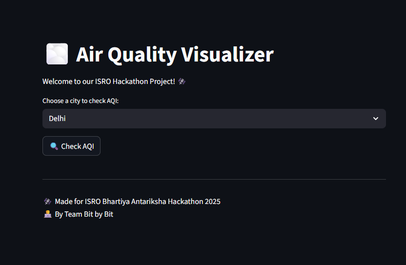
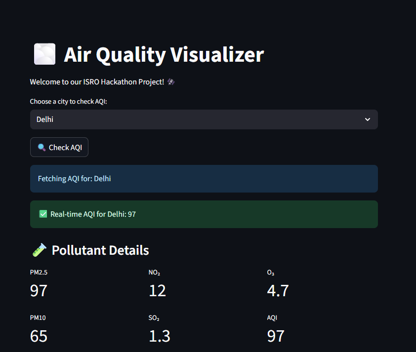
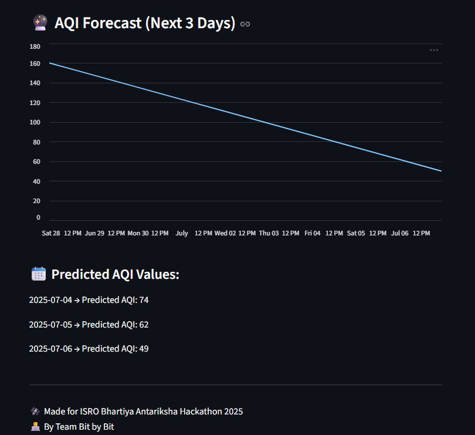
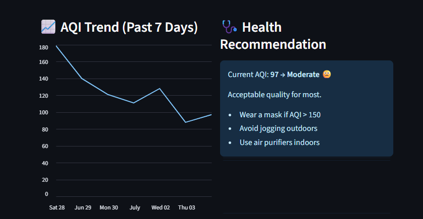

# 🌫️ Air Quality Visualizer  
Made for ISRO Bhartiya Antariksha Hackathon 2025 🚀  
By: Team Bit by Bit

---

## 📌 Objective

To build a simple, effective web-based tool that helps users visualize real-time air quality (AQI), view pollutant breakdowns, understand health impacts, and forecast air pollution trends for the next 3 days.

---

## ✅ Features

- 🌍 Select city and view real-time AQI (via WAQI API)
- 🧪 See PM2.5, PM10, NO₂, SO₂, O₃ pollutant values
- 📈 7-day AQI trend chart
- 🩺 Health recommendation system based on AQI
- 🔮 Forecast next 3 days' AQI using Prophet
- ⚠️ Alerts if AQI is hazardous
- 📥 Download AQI trend as CSV
- 👨‍💻 Built with Streamlit (fast & responsive UI)

---

## 🔧 Tech Stack

| Tool           | Purpose                        |
|----------------|--------------------------------|
| Python         | Main programming language      |
| Streamlit      | Frontend web app framework     |
| Prophet        | Time series forecasting        |
| WAQI API       | Real-time AQI data             |
| pandas, numpy  | Data processing                |
| matplotlib     | Graphs (via Streamlit backend) |

---

## 📊 Screenshots






---

## 🏥 AQI Health Guide (Used)

| AQI Range | Category                         |
|-----------|----------------------------------|
| 0–50      | Good 😊                          |
| 51–100    | Moderate 😐                      |
| 101–150   | Unhealthy for Sensitive Groups 😷 |
| 151–200   | Unhealthy 😷                     |
| 201–300   | Very Unhealthy ☠️                |
| 301+      | Hazardous 🚫                     |

---

## 🚀 How to Run Locally

1. Clone the repo or download the files  
2. Install requirements:
```bash
pip install -r requirements.txt
```

3. Run the app:
```bash
streamlit run app.py
```

---

## 👥 Team

Team Name: Bit by Bit  
Members:
- [Yuvraj Singh] ( Backend / UI / API/ Presentation)
- [Krish Singh] ( Frontend / Forecasting)
